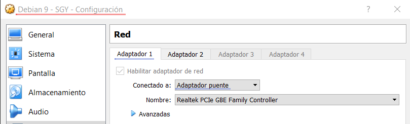
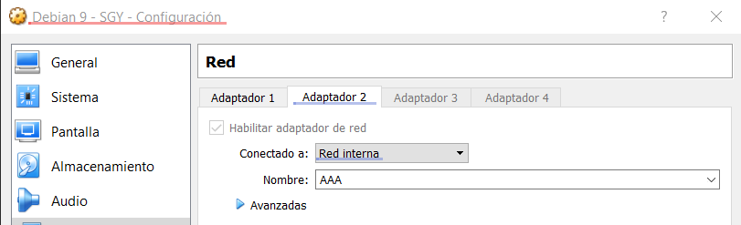
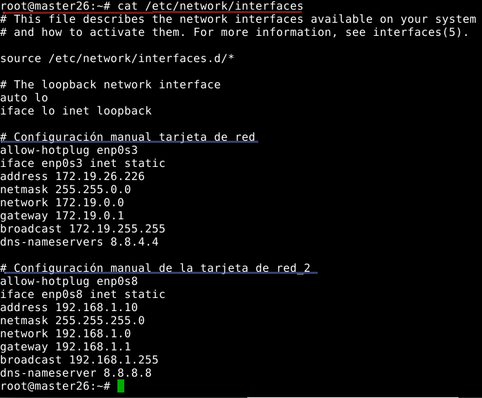
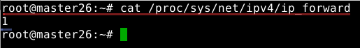
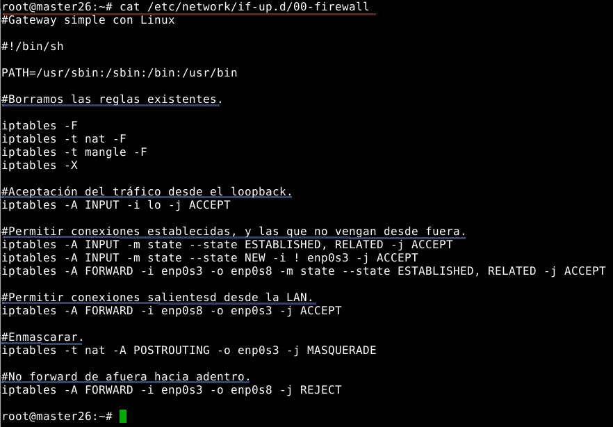
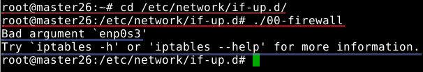

# SGY03_04 Iptables.

## 1. Introducción.
Vamos a utilizar una máquina Debian 9 para esta práctica.

## 2. Preparativos.
Debemos configurar dos tarjetas de red en nuestra MV.
* La primera será en *modo puente*.

* La segunda será *red interna*.

Encendemos la máquina y configuramos las interfaces, la tarjeta que pusimos como *puente* será la que nos comunique con la red externa y la que se destinó como *red interna* será la de nuestra intranet.

Ya hemos habilitado el *bit de IP forwarding*.

## 3. Creación del script.

Comprobamos el contenido del script que contiene las reglas. Lo hemos creado en la ruta */etc/network/if-up.d/* para que se ejecute según se levanten las interfaces.

Nos movemos a la ruta para ejecutar el script.

>Nota: no nos reconoce las interfaces y da error.
