# SGY04_03 Squid - PfSense.

#### 1. Pestaña System.

En esta nos dirigimos al apartafo de Package Manager.

Buscamos el servicio a instalar, que en este caso es Squid.

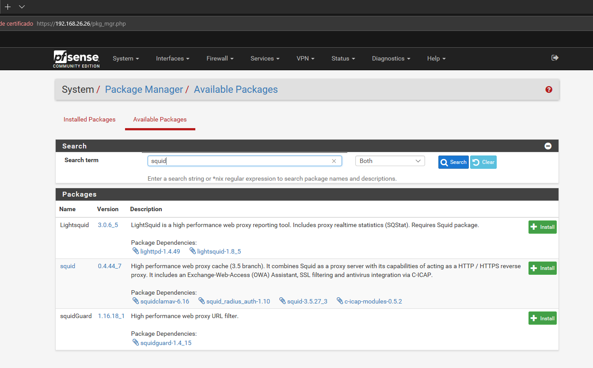

Confirmamos la instalación.

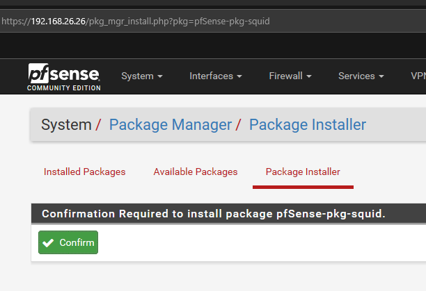

Vemos el proceso de la instalación.

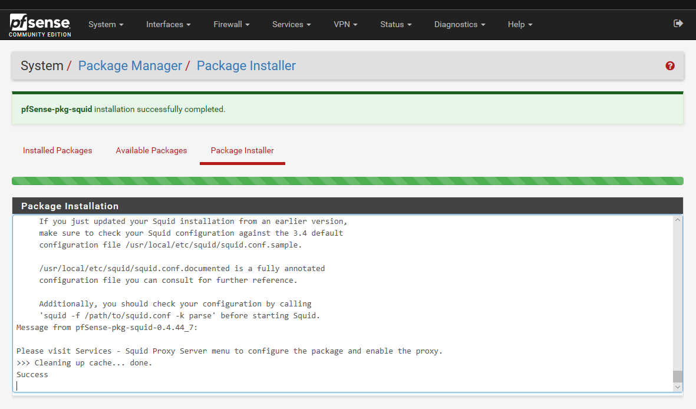

Ya instalado.

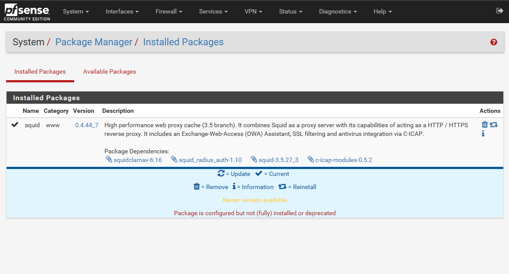

#### 2. Pestaña Services.

Ahora vamos al aparado Squid Proxy Server.

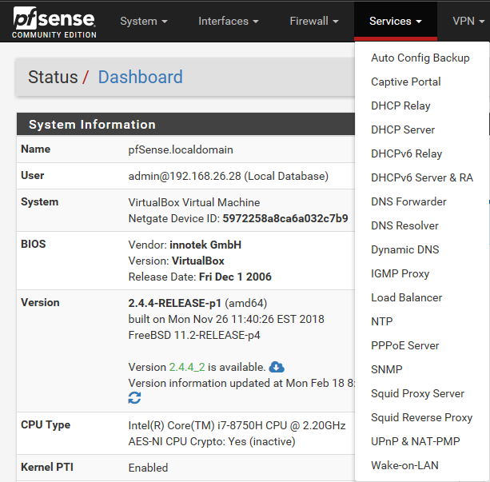

Vamos a las opciones generales y picamos en Enable Squid Proxy y en Proxy Interfaces elegimos LAN.

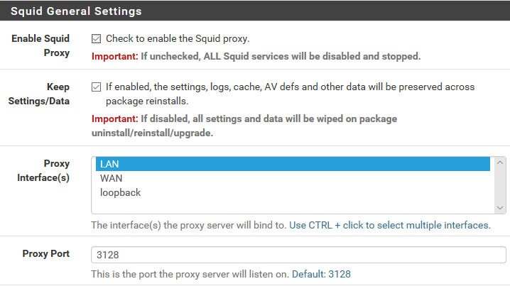

En Transparent Proxy Interfaces LAN también.

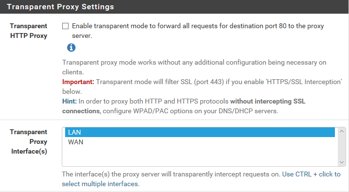

En SSL Man In the Middle Filtering elegimos LAN.

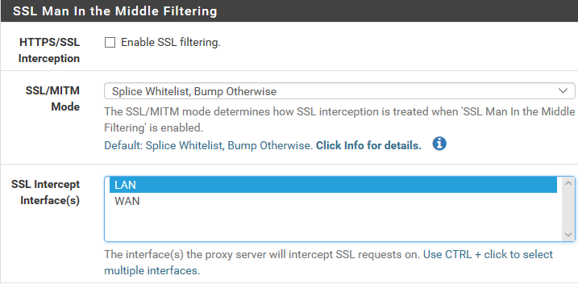

En Rotate Logs ponemos 7 días.

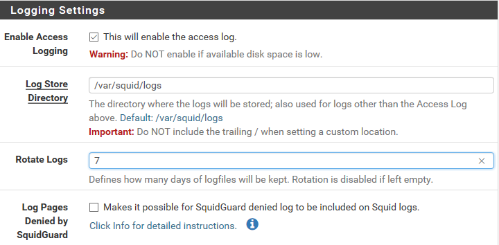

Ponemos el lenguaje en Español.

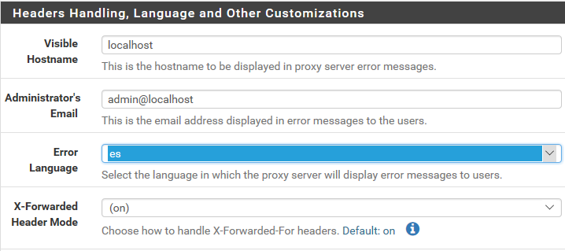

Guardamos.

Habilitamos el antivirus.

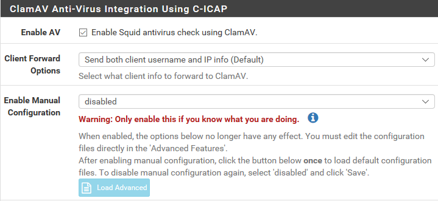

Ponemos que se actualice la base cada 24h.

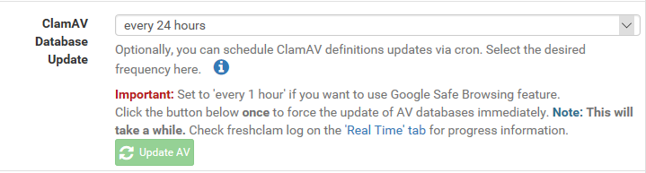

Guardamos.

En las ACL's ponemos la red interna que estamos usando.

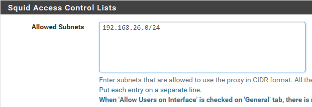

Bloqueamos esta URL.

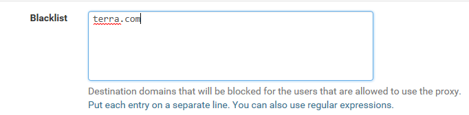

Guardamos.

#### 3. Pestaña Status.

Ahora vamos a services.

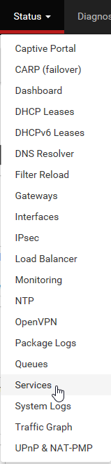

Vemos todos los servicios y vamos a iniciar el Squid.

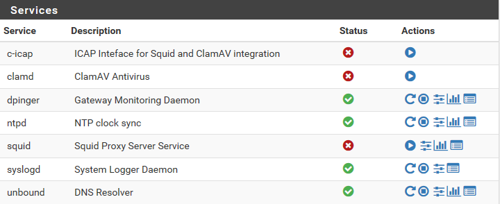

Comprobamos que está iniciado.

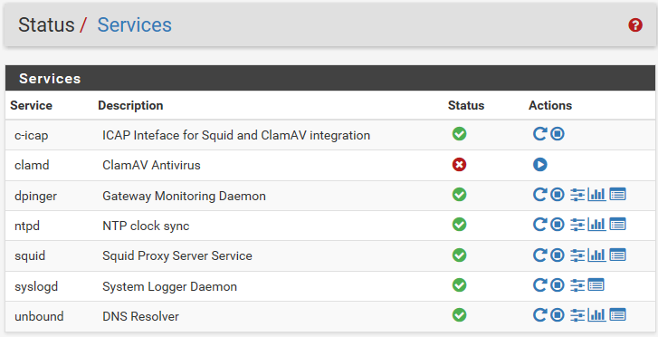

Comprobamos el puerto del Proxy.

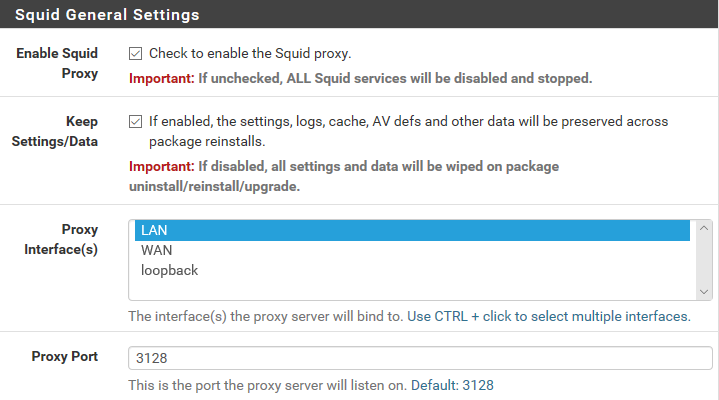

En el Explorer vamos a las opciones de Internet.

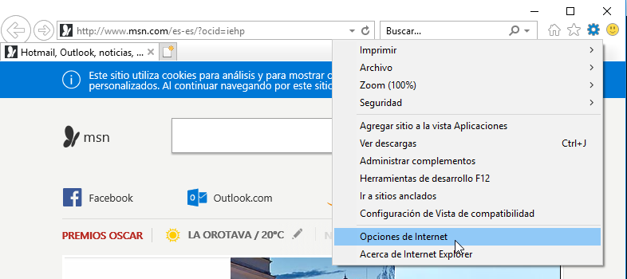

Configuración de la LAN.

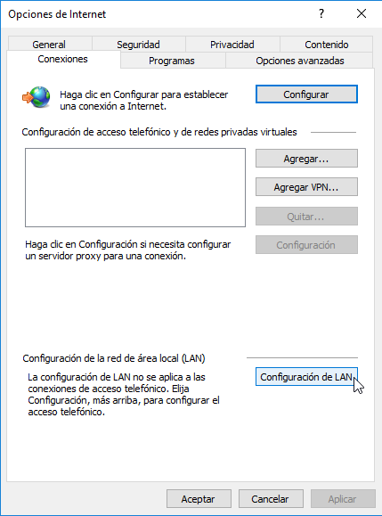

Usamos nuestro servidor Proxy, poniendo la IP y el puerto de la máquina.

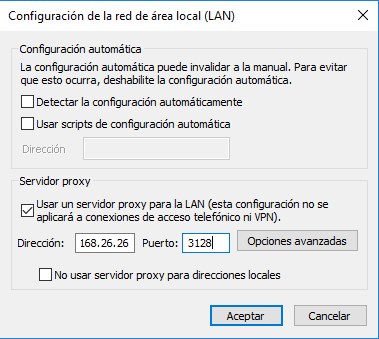

Comprobamos que no podemos acceder a la URL que pusimos en la lista negra.

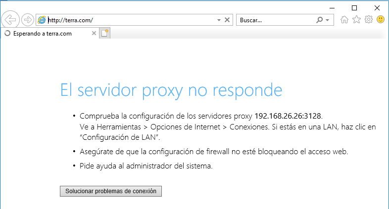
